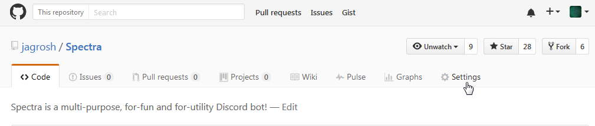
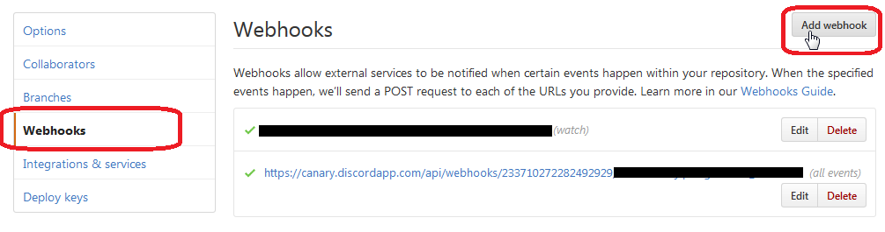
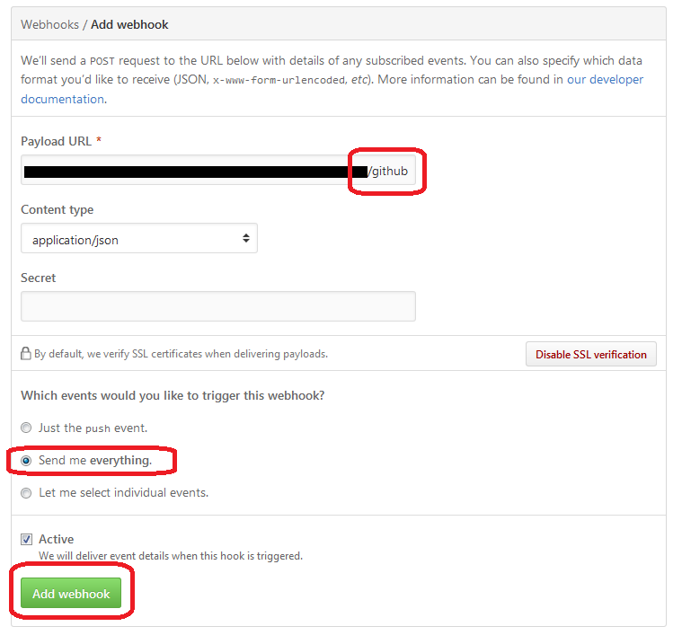

# Step 1 - Make a Discord Webhook
1. Find the Discord channel in which you would like to send commits and other updates

2. In the settings for that channel, find the Webhooks option and create a new webhook. Note: Do NOT give this URL out to the public. Anyone or service can post messages to this channel, without even needing to be in the server. Keep it safe!

# Step 2 - Set up the webhook on Github
1. Navigate to your repository on Github, and open the Settings

2. Select Add Webhook

3. Paste in the webhook url and append `/github` to the end. Select "Send me everything", set the type to `application/json`, and then Add Webhook

4. Test it by updating something or starring the repository! If it works, you're all set!

Tutorial forked by [jagrosh/Github Webhook Tutorial.md](https://gist.github.com/jagrosh/5b1761213e33fc5b54ec7f6379034a22)

